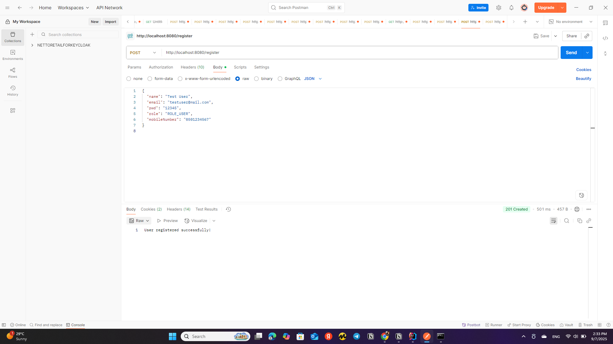
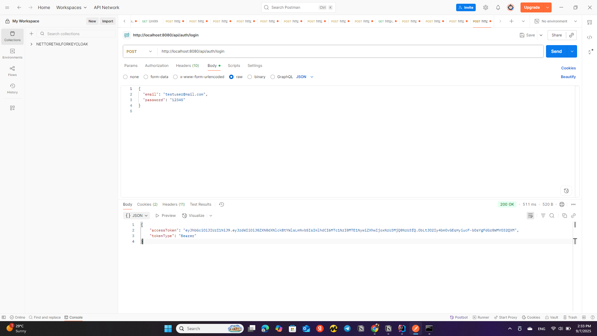
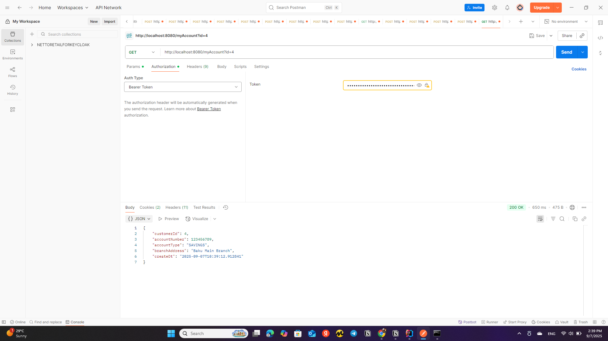

## 🌐 Spring Boot JWT Authentication Template

[](https://openjdk.org/projects/jdk/17/)
[](https://spring.io/projects/spring-boot)
[](https://spring.io/projects/spring-security)
[](LICENSE)

A production-ready template for building secure REST APIs with **Spring Boot 3** and **JWT (JSON Web Tokens)**.  
This project demonstrates how to implement stateless authentication and role-based authorization using Spring Security.

---

## ✨ Features
- 🔑 **JWT Authentication** (login endpoint, token generation, refresh token support)  
- 🛡️ **Role-Based Access Control** (e.g., `USER`, `ADMIN`)  
- 📦 **Stateless Security** (no session storage, scalable APIs)  
- 🧪 **Exception Handling** for invalid/expired tokens  
- 📝 **Ready-to-Use REST Endpoints**  
- ⚡ Built with **Spring Boot 3**, **Spring Security 6**, **Maven/Gradle**  

---

## 📂 Project Structure
```bash
src/main/java/com/walletwave/jwtlogintemplate
│── config/ # Spring Security config (SecurityFilterChain, PasswordEncoder)
│ ├── ProjectSecurityConfig.java
│ ├── WalletWaveUserDetailsService.java
│ └── WalletWaveUsernamePwdAuthenticationProvider.java
│
│── controller/ # REST Controllers (Auth, Account, User, etc.)
│ ├── AuthController.java
│ ├── AccountController.java
│ └── UserController.java
│
│── dto/ # Data Transfer Objects (LoginRequest, LoginResponse)
│
│── events/ # Authentication event listeners (login success/failure)
│ └── AuthenticationEvents.java
│
│── exceptionhandling/ # Custom exception handlers
│ └── CustomAccessDeniedHandler.java
│
│── filter/ # JWT and security filters
│ ├── JwtAuthenticationFilter.java
│ └── CsrfCookieFilter.java
│
│── model/ # Entities (mapped to DB tables)
│ ├── Accounts.java
│ └── Customer.java
│
│── repository/ # Spring Data JPA repositories
│ ├── AccountsRepository.java
│ └── CustomerRepository.java
│
│── service/ # Business logic and JWT service
│ └── JwtService.java
│
│── SpringBootJwtLoginTemplateApplication.java # Main class

src/main/resources
│── application.yml # Application configuration
│── sql/ # SQL initialization scripts
│── static/ # Static resources (css, images, screenshots)
│ └── screenshots/
│ ├── register_success.png
│ ├── jwt_token.png
│ └── myaccount_success.png
│── templates/ # (if using Thymeleaf or other templating)


src/main/resources  


│── application.yml # Application configuration
│── sql/ # SQL initialization scripts
│── static/ # Static resources (css, images, screenshots)
│ │── screenshots/ # Project screenshots for README
│── templates/ 

---

```

## 🚀 Getting Started

### Clone the repository
```bash
git clone https://github.com/tomrist9/spring-boot-jwt-template.git
cd spring-boot-jwt-template

Configure Database

Update application.yml (or application.properties) with your PostgreSQL/MySQL credentials:

spring:
  datasource:
    url: jdbc:postgresql://localhost:5432/jwt_demo
    username: postgres
    password: yourpassword
  jpa:
    hibernate:
      ddl-auto: update
    show-sql: true

Run the Application
./mvnw spring-boot:run


or

./gradlew bootRun

🔐 API Endpoints
Authentication

POST /api/auth/login → Generate JWT token
Request:

{
  "username": "user",
  "password": "password"
}


Response:

{
  "accessToken": "eyJhbGciOiJIUzI1NiIsInR...",
  "tokenType": "Bearer"
}

Secured API

GET /api/users/me → Get current user info (requires JWT token in header)

Example:

GET /api/users/me
Authorization: Bearer <JWT_TOKEN>

```


## 🛠️ Tech Stack

Java 17

Spring Boot 3

Spring Security 6

JWT (jjwt library)

PostgreSQL/MySQL

Maven/Gradle

## 📸 Screenshots
1. User Registration

2. Login & JWT Token

3. Access Protected Endpoint (/myAccount)


## 📌 Use Cases

This template can be used to:

Secure microservices with JWT

Build a starter kit for SaaS products

Integrate with frontend apps (React, Angular, Vue)

## 💡 Next Steps

Add Refresh Tokens

Add Unit/Integration Tests

Extend with OAuth2 Login (Google, GitHub, Facebook)

## 🧑‍💻 Author

Built by Tomris Teymurlu


---

[](https://github.com/tomrist9/spring-boot-jwt-login-template/actions)
[](LICENSE)
[](https://github.com/tomrist9/spring-boot-jwt-login-template/stargazers)
[](https://github.com/tomrist9/spring-boot-jwt-login-template/issues)
[](https://github.com/tomrist9/spring-boot-jwt-login-template/commits/main)
