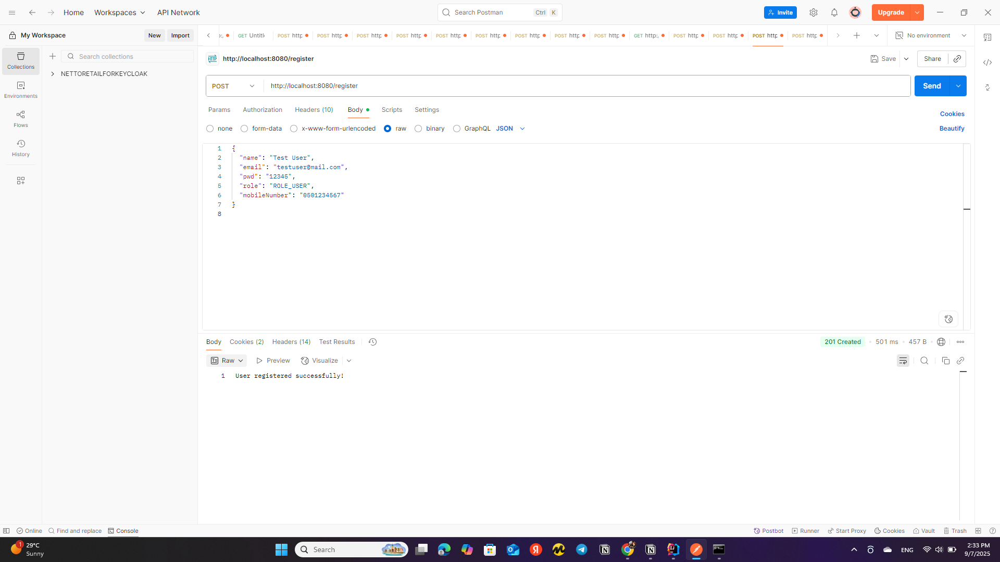
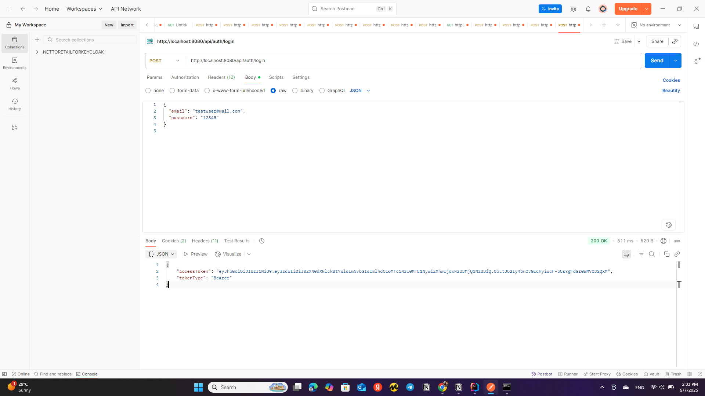
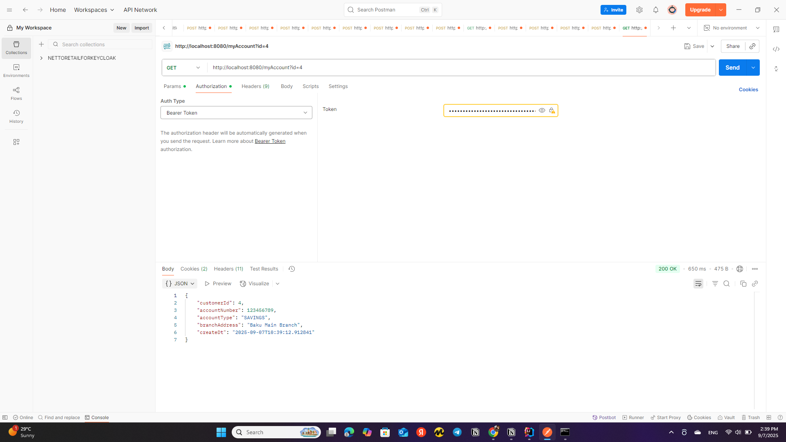

##  Spring Boot JWT Authentication Template

[](https://openjdk.org/projects/jdk/17/)
[](https://spring.io/projects/spring-boot)
[](https://spring.io/projects/spring-security)

A production-ready template for building secure REST APIs with **Spring Boot 3** and **JWT (JSON Web Tokens)**.  
This project demonstrates how to implement stateless authentication and role-based authorization using Spring Security.
It is the **Phase 1** of the [Spring Security Series](https://github.com/tomrist9/spring-security-series).

---

##  Features
-  **JWT Authentication** (login endpoint, token generation, refresh token support)  
-  **Role-Based Access Control** (e.g., `USER`, `ADMIN`)  
-  **Stateless Security** (no session storage, scalable APIs)  
-  **Exception Handling** for invalid/expired tokens  
-  **Ready-to-Use REST Endpoints**  
-  Built with **Spring Boot 3**, **Spring Security 6**, **Maven/Gradle**  

---

## 📂 Project Structure
```bash
src/main/java/com/walletwave/jwtlogintemplate
│── config/ 
│ ├── ProjectSecurityConfig.java
│ ├── WalletWaveUserDetailsService.java
│ └── WalletWaveUsernamePwdAuthenticationProvider.java
│
│── controller/ 
│ ├── AuthController.java
│ ├── AccountController.java
│ └── UserController.java
│
│── dto/
│
│── events/ 
│ └── AuthenticationEvents.java
│
│── exceptionhandling/ 
│ └── CustomAccessDeniedHandler.java
│
│── filter/ 
│ ├── JwtAuthenticationFilter.java
│ └── CsrfCookieFilter.java
│
│── model/
│ ├── Accounts.java
│ └── Customer.java
│
│── repository/ 
│ ├── AccountsRepository.java
│ └── CustomerRepository.java
│
│── service/ 
│ └── JwtService.java
│
│── SpringBootJwtLoginTemplateApplication.java 

src/main/resources  
│── application.yml 
│── sql/
│── static/ 
│ │── screenshots/ 
│── templates/ 

---

```

##  Getting Started

### Clone the repository
```bash
git clone https://github.com/tomrist9/spring-boot-jwt-template.git 
cd spring-boot-jwt-template


```

### Configure Database

Update application.yml (or application.properties) with your PostgreSQL/MySQL credentials:

spring:
  datasource:
    url: jdbc:postgresql://localhost:5432/jwt_demo
    username: postgres
    password: yourpassword
  jpa:
    hibernate:
      ddl-auto: update
    show-sql: true

Run the Application
./mvnw spring-boot:run


or

./gradlew bootRun

### API Endpoints
Authentication

POST /api/auth/login → Generate JWT token
Request:

{
  "username": "user",
  "password": "password"
}


Response:

{
  "accessToken": "eyJhbGciOiJIUzI1NiIsInR...",
  "tokenType": "Bearer"
}

Secured API

GET /api/users/me → Get current user info (requires JWT token in header)

Example:

GET /api/users/me
Authorization: Bearer <JWT_TOKEN>


```

##   Tech Stack

Java 17

Spring Boot 3

Spring Security 6

JWT (jjwt library)

PostgreSQL/MySQL

Maven/Gradle

## 📸 Screenshots
1. User Registration

2. Login & JWT Token

3. Access Protected Endpoint (/myAccount)


## 📌 Use Cases

This template can be used to:

Secure microservices with JWT

Build a starter kit for SaaS products

Integrate with frontend apps (React, Angular, Vue)


---

[](https://github.com/tomrist9/spring-boot-jwt-login-template/stargazers)
[](https://github.com/tomrist9/spring-boot-jwt-login-template/issues)
[](https://github.com/tomrist9/spring-boot-jwt-login-template/commits/main)
